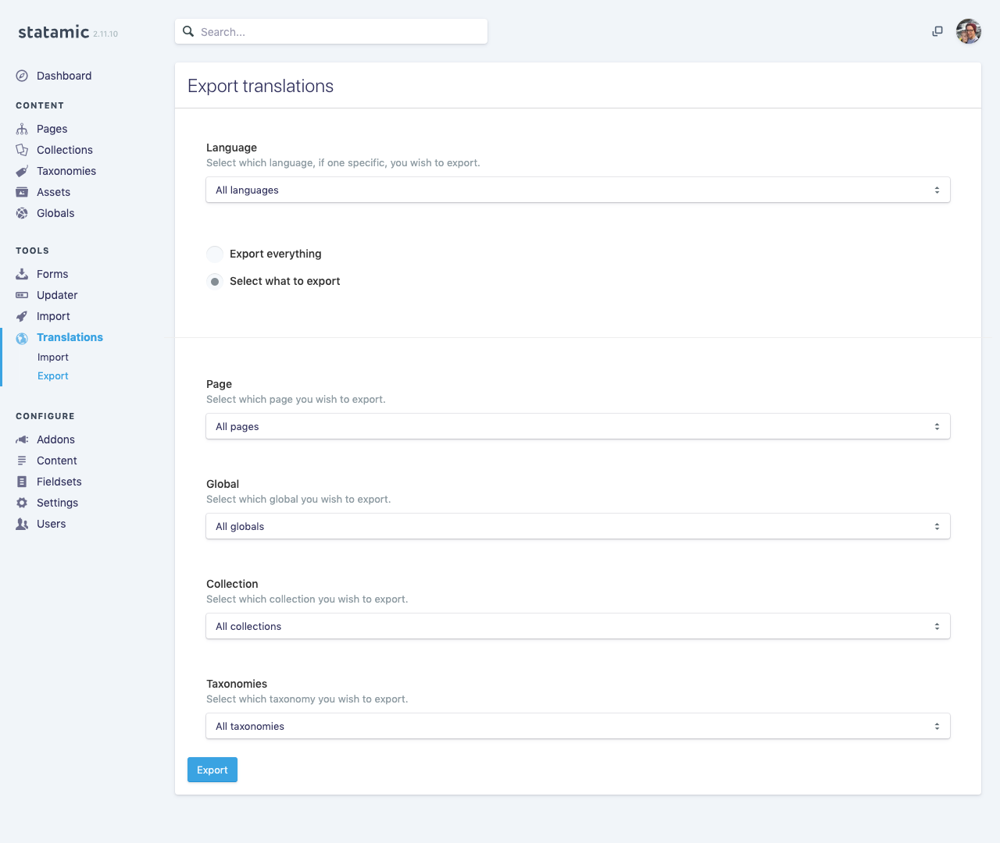
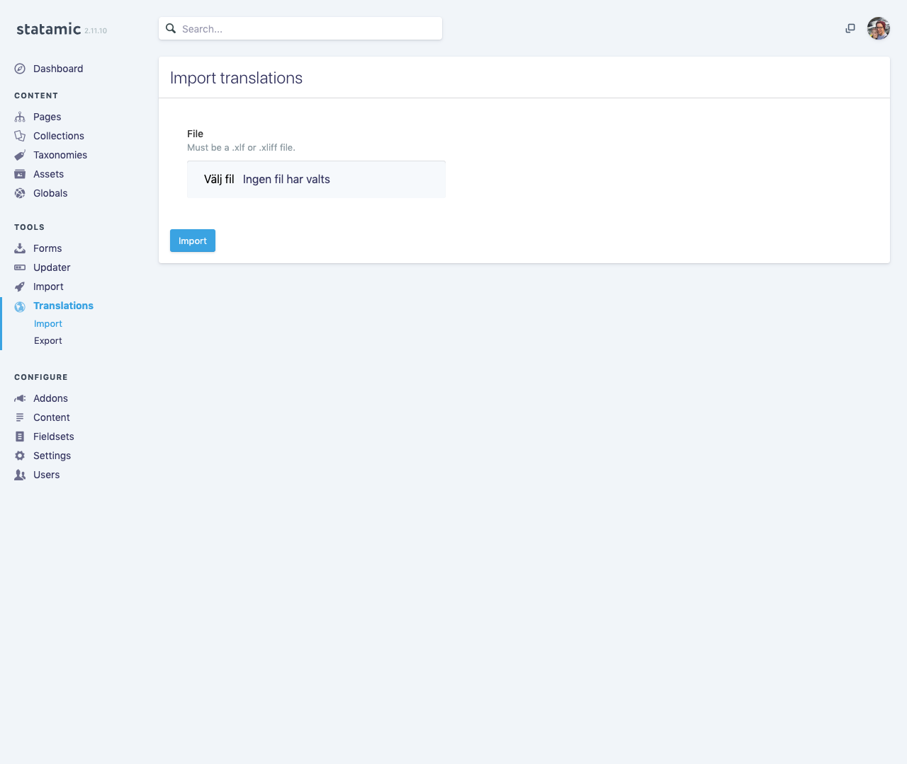

# statamic-translation-manager
A Statamic addon for importing or exporting translatable content to the standardized .xlf/.xliff format.

| Export your site's translations | Import the translated file |
| --------- | --------- |
|  |  |
  
**:tada: The addon now supports nested data structures!**

## Instructions
For instructions and documentation, please refer to [documentation.md](DOCUMENTATION.md) or to the [Statamic Marketplace](https://statamic.com/marketplace/addons/translation-manager).

## Description
This addon lets you export Pages, Globals, Collections and Taxonomies to all available languages or to the one you choose. 
The exported file can then be modified by a translation agency or yourself, and imported again to apply the changes to your site.

## Supported field types
| Field type    | Exporting  | Importing  |
| ------------- |:----------:|:----------:
| Text          | ✅         | ✅         |
| Markdown      | ✅         | ✅         |
| Textarea      | ✅         | ✅         |
| Bard          | ✅         | ✅         |
| List          | ✅         | ✅         |
| Array         | ✅         | ✅         |
| Tags          | ✅         | ✅         |
| Replicator    | ✅         | ✅         |
| Table         | ✅         | ✅         |

More field types will be added. Feel free to open an issue if you're missing a specific type.

## Support me
If this addon made your life a bit easier, consider buying me lunch once or twice a month [through Patreon](https://www.patreon.com/mattiaspersson). All support helps me spend more time on packages like this and also comes with a few benefits 🎁 Thanks!
